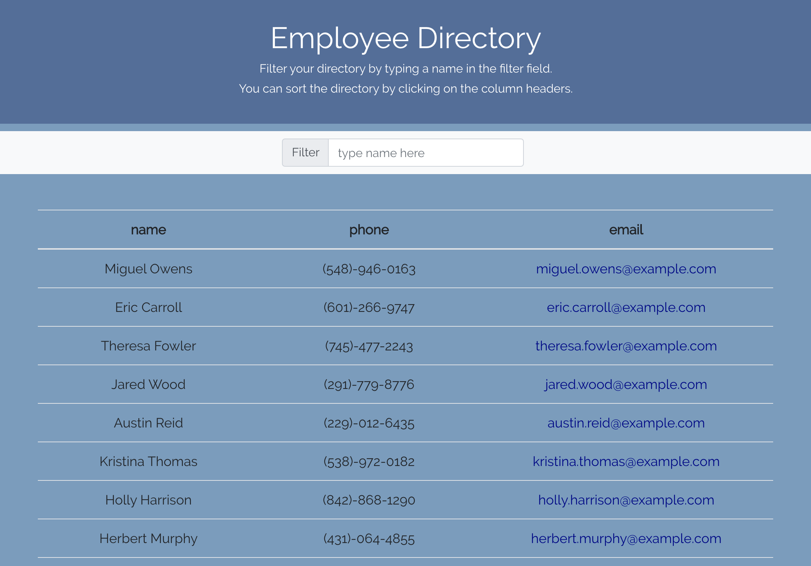

# Employee-Directory
React Homework: Employee Directory

## Description

This is an employee directory created with React. This app's UI is broken into components and responds to user events.

The directory can be filtered by typing a name in the filter field. Each column can be sorted by clicking on the column header.

## Business Context

An employee or manager would benefit greatly from being able to view non-sensitive data about other employees. It would be particularly helpful to be able to filter employees by name.

## Deployed on Heroku

[https://still-bayou-93751.herokuapp.comzz/](https://still-bayou-93751.herokuapp.comzz/)

## GitHub page

My GitHub page can be found here:

//: chriscrichter GitHub [https://github.com/chriscrichter/](https://github.com/chriscrichter/)

